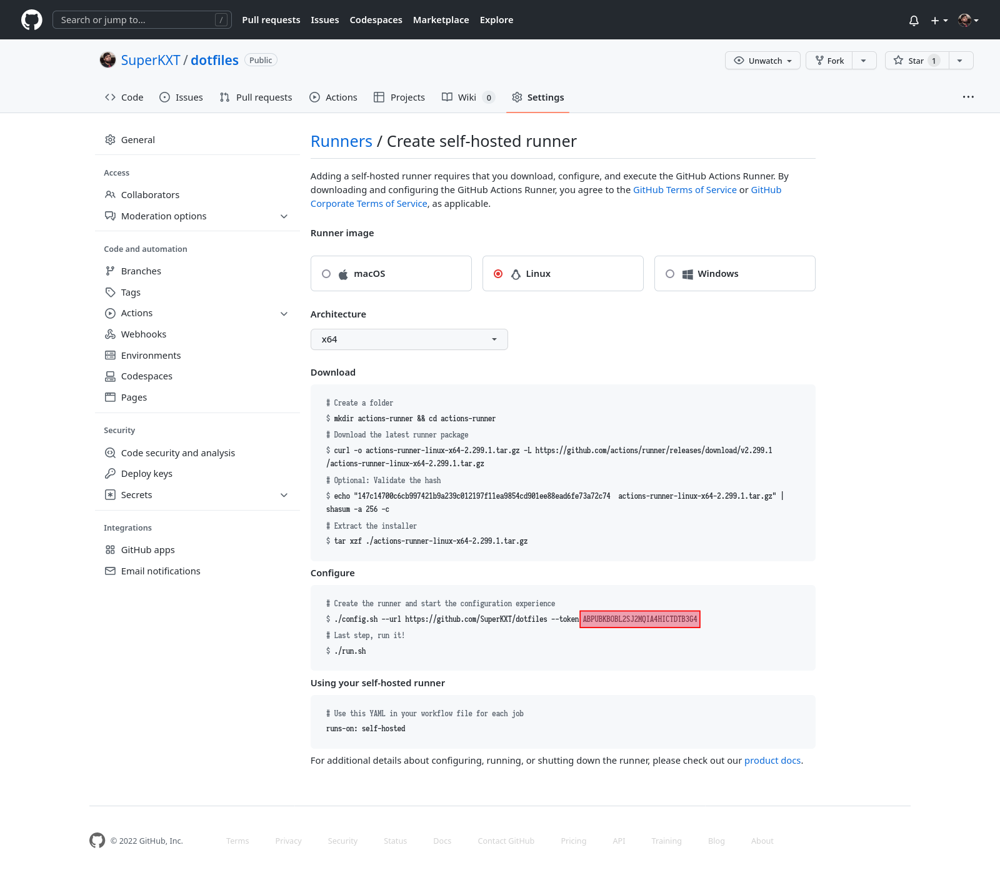

# Deployment scripts and instructions

Scripts to deploy frontend and backend projects to self-hosted servers via github actions on Windows or Linux

## Deployment

Open:

- Linux: `Bash`
- Window: `Elevated PowerShell`

Download the repository

```bash
git clone https://github.com/SuperKXT/deployments
```

Get the frontend and backend runner tokens

- Go to `github.com/{user}/{repo}/settings/actions/runners/new`
- Copy the token from the end of first command in the Configure section 

Run the script

- Windows

```powershell
./windows/setup.ps1
```

- Linux

```bash
./linux/setup.sh
```

When prompted enter the frontend and backend config

Add the appropriate tags to the runner (`production` or `qa`)
